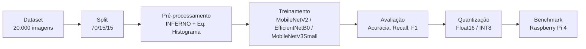

# 🌞 Detecção de Defeitos em Módulos Fotovoltaicos por Imagens Termográficas

> Estudo comparativo de redes neurais convolucionais leves com quantização pós-treinamento para deploy em sistema embarcado (Raspberry Pi).

[](https://www.python.org/)
[](https://www.tensorflow.org/)
[](https://keras.io/)
[](https://www.tensorflow.org/lite)
[](https://www.raspberrypi.com/)
[](LICENSE)

---

## 📋 Sumário

- [Sobre o projeto](#-sobre-o-projeto)
- [Resultados principais](#-resultados-principais)
- [Pipeline](#-pipeline)
- [Estrutura do repositório](#-estrutura-do-repositório)
- [Dataset](#-dataset)
- [Instalação](#-instalação)
- [Como usar](#-como-usar)
- [Resultados detalhados](#-resultados-detalhados)
- [Hardware utilizado](#-hardware-utilizado)
- [Limitações e trabalhos futuros](#-limitações-e-trabalhos-futuros)
- [Referências](#-referências)
- [Autores](#-autores)
- [Licença](#-licença)

---

## 🔍 Sobre o projeto

A geração distribuída solar fotovoltaica é hoje a **segunda maior fonte da matriz elétrica brasileira**, mas a degradação progressiva dos módulos — hotspots, falhas de diodo, sombreamento, rachaduras, sujidade — reduz a eficiência e pode causar danos irreversíveis ao sistema.

Este projeto desenvolve um **pipeline completo de classificação automática de defeitos** em módulos fotovoltaicos a partir de imagens termográficas, com foco explícito em **viabilidade de deploy em hardware embarcado de baixo custo**:

```
Dataset → Pré-processamento → Treinamento (3 arquiteturas) → Quantização → Benchmark na Raspberry Pi
```

Diferente da maior parte da literatura — que maximiza acurácia em ambiente computacional irrestrito — este trabalho avalia explicitamente o **trade-off entre acurácia, tamanho do modelo e latência de inferência** em um Raspberry Pi 4, validando a aplicação real em inspeção de campo.

---

## 🏆 Resultados principais

| Configuração | Tamanho | Acurácia (Raspberry Pi) | Latência | FPS |
|---|---|---|---|---|
| **MobileNetV2 — INT8** ⭐ | 3,1 MB | 80,30% | **65,8 ms** | **15,21** |
| MobileNetV2 — Float16 | 5,2 MB | 80,73% | 100,6 ms | 9,94 |
| EfficientNetB0 — Float16 | 8,1 MB | **81,37%** | 201,7 ms | 4,96 |
| EfficientNetB0 — INT8 | 4,9 MB | 73,13% | 242,5 ms | 4,12 |

> ⭐ **MobileNetV2 INT8** é a configuração recomendada para inspeção de campo em tempo real — melhor latência e FPS com apenas 3,1 MB e queda de acurácia de apenas 1,6 p.p. em relação ao modelo completo treinado no PC (81,90%).

---

## 🔄 Pipeline



**1. Pré-processamento** — leitura em escala de cinza → resize bicúbico 224×224 → normalização min-max → equalização de histograma → pseudocolorização com colormap **INFERNO** (converte gradiente térmico em gradiente de cor compatível com pesos ImageNet)

**2. Treinamento em 2 fases** — congelamento da base + treino do head → fine-tuning das camadas superiores com LR reduzido (AdamW + label smoothing)

**3. Quantização pós-treinamento** — conversão para TensorFlow Lite em Float16 e INT8 com dataset representativo de calibração

**4. Benchmark embarcado** — inferência real na Raspberry Pi 4, medindo latência, FPS, acurácia e uso de RAM

---

## 📁 Estrutura do repositório

```
solar-defect-detection/
├── data/                          # dataset original (não versionado)
│   ├── normal/
│   └── defect/
├── data_split/                    # gerado pelo split (não versionado)
│   ├── train/
│   ├── val/
│   └── test/
├── models/                        # modelos treinados e quantizados (não versionado)
│   ├── mobilenetv2.keras
│   ├── mobilenetv2_f16.tflite
│   └── mobilenetv2_int8.tflite
├── results/                       # gráficos e CSVs de resultados
│   ├── comparativo_acuracia.png
│   ├── comparativo_quantizacao.png
│   ├── resumo_comparativo.csv
│   └── resumo_quantizacao.csv
├── results_raspberry/             # benchmark de inferência embarcada
│   ├── benchmark_completo.csv
│   └── comparativo_raspberry.png
├── notebooks/
│   └── pipeline_final.ipynb       # pipeline completo em notebook
├── src/
│   ├── pipeline_final.py          # treino + avaliação + quantização (PC)
│   ├── inference_raspberry.py     # benchmark de inferência (Raspberry Pi)
│   └── predict_individual.py      # predição/visualização individual
├── requirements.txt
├── requirements-raspberry.txt
├── .gitignore
├── LICENSE
└── README.md
```

---

## 🗂️ Dataset

**[Infrared Solar Modules Dataset](https://www.kaggle.com/datasets/marcosgabriel/infrared-solar-modules)** (Kaggle) — 20.000 imagens termográficas, resolução nativa de **40×24 pixels**.

| Classe original | Quantidade | Classe binária |
|---|---|---|
| No-Anomaly | 10.000 | **Normal** |
| Cell, Cell-Multi, Cracking, Diode, Diode-Multi, Hot-Spot, Hot-Spot-Multi, Offline-Module, Shadowing, Soiling, Vegetation | 10.000 | **Defeito** |

Divisão estratificada: **70% treino / 15% validação / 15% teste** (seed fixo = 42 para reprodutibilidade).

> ⚠️ O dataset não está incluído neste repositório por questões de tamanho. Baixe do Kaggle e organize em `data/normal/` e `data/defect/` antes de rodar o pipeline.

---

## ⚙️ Instalação

### No PC (treino, avaliação e quantização)

```bash
git clone https://github.com/seu-usuario/solar-defect-detection.git
cd solar-defect-detection

python -m venv env
source env/bin/activate        # Linux/Mac
env\Scripts\activate           # Windows

pip install -r requirements.txt
```

### Na Raspberry Pi (inferência embarcada)

```bash
pip install -r requirements-raspberry.txt
```

---

## 🚀 Como usar

### 1. Organize o dataset

```
data/
├── normal/   → imagens da classe No-Anomaly
└── defect/   → imagens das 11 classes de defeito unificadas
```

### 2. Rode o pipeline completo (PC)

```bash
python src/pipeline_final.py
```

Executa automaticamente: split → pré-processamento → treino das 3 arquiteturas → avaliação → quantização Float16/INT8 → avaliação dos modelos quantizados.

> Alternativa: abra `notebooks/pipeline_final.ipynb` para rodar célula por célula.

### 3. Copie os modelos `.tflite` para a Raspberry Pi

```bash
scp models/*.tflite pi@<ip-da-raspberry>:~/solar-defect-detection/models/
```

### 4. Rode o benchmark na Raspberry Pi

```bash
python src/inference_raspberry.py --test_dir data_split/test
```

### 5. Teste uma imagem individual

```bash
python src/predict_individual.py --image caminho/imagem.jpg --model models/mobilenetv2.keras
```

---

## 📊 Resultados detalhados

### Treinamento (conjunto de teste, PC)

| Arquitetura | Acurácia | Precisão Defeito | Recall Defeito | F1 Macro |
|---|---|---|---|---|
| **MobileNetV2** | 81,90% | 75,88% | 93,53% | 81,65% |
| **EfficientNetB0** | 81,40% | 75,08% | 94,00% | 81,10% |
| MobileNetV3Small | 50,00%¹ | — | — | — |

¹ Não convergiu em nenhuma das configurações testadas — excluída das etapas de quantização e benchmark.

### Quantização pós-treinamento

| Modelo / Formato | Tamanho | Redução | Acurácia | Δ vs. Full |
|---|---|---|---|---|
| MobileNetV2 — Full | 27,3 MB | — | 81,90% | — |
| MobileNetV2 — Float16 | 5,2 MB | 81% | 82,17% | **+0,27%** |
| MobileNetV2 — INT8 | 3,1 MB | 89% | 80,50% | −1,40% |
| EfficientNetB0 — Full | 32,6 MB | — | 81,40% | — |
| EfficientNetB0 — Float16 | 8,1 MB | 75% | 81,40% | 0,00% |
| EfficientNetB0 — INT8 | 4,9 MB | 85% | 77,33% | −4,07% |

### Benchmark Raspberry Pi 4 (n = 3.000 imagens)

| Modelo / Formato | Acurácia | Latência média | FPS |
|---|---|---|---|
| MobileNetV2 — Float16 | 80,73% | 100,6 ms | 9,94 |
| **MobileNetV2 — INT8** | 80,30% | **65,8 ms** | **15,21** |
| **EfficientNetB0 — Float16** | **81,37%** | 201,7 ms | 4,96 |
| EfficientNetB0 — INT8 | 73,13% | 242,5 ms | 4,12 |

> 📌 Achado relevante: o EfficientNetB0 INT8 apresentou comportamento atípico na Raspberry Pi — latência *maior* que o Float16, sugerindo que o mecanismo de Squeeze-and-Excitation não se beneficia das otimizações de inteiro do processador ARM Cortex-A72 da mesma forma que o MobileNetV2.

---

## 💻 Hardware utilizado

| | Treinamento | Inferência embarcada |
|---|---|---|
| **Dispositivo** | PC | Raspberry Pi 4 Model B |
| **Processador** | Intel Core i5-1135G7 | ARM Cortex-A72 quad-core |
| **RAM** | 16 GB | 4 GB |
| **Armazenamento** | SSD NVMe | microSD |
| **Sistema** | Windows | Raspberry Pi OS (64-bit) |
| **Runtime** | TensorFlow / Keras 3.x | TensorFlow Lite Runtime |

---

## 🔭 Limitações e trabalhos futuros

**Limitações identificadas:**
- Resolução nativa das imagens de apenas 40×24 pixels — limita a informação espacial disponível
- MobileNetV3Small não convergiu em nenhuma configuração testada
- Dataset público único — sem validação com captura térmica própria em campo
- Sistema opera sobre imagens pré-capturadas, sem aquisição térmica em tempo real

**Direções futuras:**
- [ ] Classificação multiclasse (identificar o tipo específico de defeito entre as 11 classes)
- [ ] Integração com câmera térmica real (FLIR Lepton / AMG8833) na Raspberry Pi
- [ ] Avaliação de arquiteturas adicionais (EfficientNet-Lite, MobileOne)
- [ ] Conversão para TensorRT / ONNX Runtime para redução adicional de latência
- [ ] Coleta de dataset próprio em instalações fotovoltaicas brasileiras

---

## 📚 Referências

- KORKMAZ, D.; ACIKGOZ, H. An efficient fault classification method in solar photovoltaic modules using transfer learning and multi-scale convolutional neural network. **Engineering Applications of Artificial Intelligence**, v. 113, 2022.
- SANDLER, M. et al. MobileNetV2: Inverted Residuals and Linear Bottlenecks. **CVPR**, 2018.
- TAN, M.; LE, Q. EfficientNet: Rethinking Model Scaling for Convolutional Neural Networks. **ICML**, 2019.
- VIEIRA, R. G. Aplicação de técnicas de inteligência artificial para identificação de faltas em módulos fotovoltaicos. Tese (Doutorado) — UFRN, 2021.
- Dataset: [Infrared Solar Modules Dataset](https://www.kaggle.com/datasets/marcosgabriel/infrared-solar-modules) (Kaggle)

---

## 👥 Autores

Trabalho de Conclusão de Curso — Engenharia Elétrica — Faculdade Matias Machline (FMM), Manaus-AM

- **Isaac Davi da Silva Martins**
- **Sandoval Marques de Oliveira Filho**

Orientador: Prof. Emerson Leão Brito do Nascimento

---

## 📄 Licença

Este projeto está licenciado sob a licença MIT — veja o arquivo [LICENSE](LICENSE) para mais detalhes.

---

<p align="center">
  Feito com 🔆 para um setor solar mais inteligente e acessível.
</p>